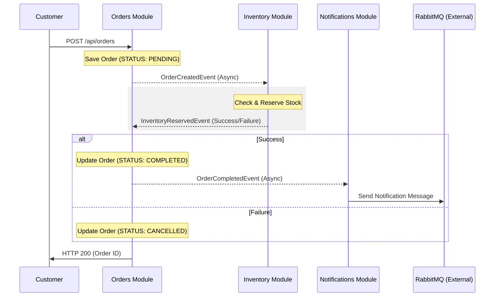

# Modular Order System - Spring Modulith Showcase

This project is a production-grade demonstration of **Modular Monolith** architecture using **Spring Modulith**, **RabbitMQ**, and **Domain-Driven Design (DDD)** principles.

## 📌 Project Scope

This is a **showcase project** demonstrating:
- **Spring Modulith**: Modular architecture with enforced boundaries.
- **Event-Driven Saga**: Patterns for asynchronous inter-module communication.
- **RabbitMQ Integration**: Decoupled messaging for external systems.
- **Domain-Driven Design**: Bounded contexts and aggregate roots.
- **Production-Grade Testing**: Architecture, integration, and unit testing practices.

**Intentionally NOT included:**
- **CI/CD Pipelines**: No additional learning value in a single-developer showcase.
- **Production Security Layer**: OAuth2/Keycloak is out of scope for this demonstration.
- **Kubernetes Deployment**: Over-engineering for an architectural showcase.

The goal is to demonstrate **architectural understanding and clean implementation**, focusing on core mechanics rather than simulating a complete cloud-production system.

## 🚀 Key Features

- **Modular Architecture**: Strong boundaries enforced by Spring Modulith.
- **Event-Driven Saga**: Decoupled inter-module communication using asynchronous domain events.
- **External Messaging**: Integration with RabbitMQ for shipping notifications.
- **Production-Ready Observability**: Actuator, Prometheus metrics, and JSON logging.
- **API Documentation**: Automated Swagger/OpenAPI 3.0 documentation.
- **Resilient Infrastructure**: PostgreSQL with Flyway migrations and RabbitMQ with DLQ/Retries.

## 🏗 Architecture Overview

The system is divided into three main bounded contexts:

1.  **Orders Module**: Orchestrates the order lifecycle.
2.  **Inventory Module**: Manages stock levels and reservations.
3.  **Notifications Module**: Handles external communication via RabbitMQ.

### Event Flow (Saga)



1.  `OrderService` creates an order...

## 🛠 Tech Stack


- **Language**: Java 21 (Records, Functional Programming)
- **Framework**: Spring Boot 3.4.1 + Spring Modulith
- **Messaging**: RabbitMQ (Asynchronous Saga Pattern)
- **Persistence**: PostgreSQL + Hibernate JPA + Flyway
- **Observability**: Micrometer + Prometheus + Spring Actuator
- **Testing**: JUnit 5 + Mockito + Testcontainers
- **API Documentation**: SpringDoc OpenAPI (Swagger UI)
- **Containerization**: Docker & Multi-stage Dockerfile


## 🚦 Getting Started

### Prerequisites

- Docker and Docker Compose
- JDK 21
- Maven

### Running the Infrastructure

```bash
docker-compose up -d
```

### Running the Application

```bash
./mvnw spring-boot:run
```

## 📖 API Documentation

Once the application is running, you can access:

| Service | Endpoint | Description |
| :--- | :--- | :--- |
| **Swagger UI** | [/swagger-ui.html](http://localhost:8080/swagger-ui.html) | Interactive API exploration |
| **Actuator** | [/actuator](http://localhost:8080/actuator) | Application health and info |
| **Prometheus** | [/actuator/prometheus](http://localhost:8080/actuator/prometheus) | Metrics for monitoring |
| **RabbitMQ** | [localhost:15672](http://localhost:15672) | Message Broker Console (guest/guest) |

## 🧪 Usage Example (Saga Flow)

To test the complete Event-Driven flow, you can use the following `curl`:

```bash
# 1. Create a new Order
curl -X POST http://localhost:8080/api/orders \
  -H "Content-Type: application/json" \
  -d '{
    "customerId": "CUST-001",
    "customerEmail": "senior-dev@example.com",
    "items": [
      {
        "productId": "PROD-001",
        "productName": "Laptop",
        "quantity": 2,
        "unitPrice": 1200.00
      }
    ]
  }'

# 2. Check Order Status (The saga will complete asynchronously)
curl http://localhost:8080/api/orders/customer/CUST-001
```

## 🧠 Architectural Decisions

### Why Modular Monolith?
- **Cognitive Load**: Easier to understand and develop than distributed microservices.
- **Operational Excellence**: Single deployment unit, simplified monitoring, and zero network latency between modules.
- **Strong Boundaries**: Spring Modulith enforces logical separation at compile-time/test-time, preventing "Big Ball of Mud".

### Event-Driven Communication
- **Decoupling**: Modules communicate via Domain Events. `Orders` doesn't know about `Inventory` implementation.
- **Transactional Integrity**: Uses Spring Modulith's Event Publication Registry to ensure "At Least Once" delivery even if the broker is down.

## 🔮 Future Enhancements (Not Implemented)

This is a showcase project focused on demonstrating architectural patterns. Production considerations intentionally omitted to keep the focus on core mechanics:

- **CI/CD Pipeline**: Implementation of GitHub Actions/Jenkins for automated delivery.
- **Kubernetes Manifests**: Helm charts or K8s YAMLs for container orchestration (over-engineering for this showcase).
- **Security Layer**: Integration with OAuth2/Keycloak or Spring Security for JWT-based auth.
- **Event Sourcing**: Alternative pattern for data persistence (could be implemented in a separate branch).

---


