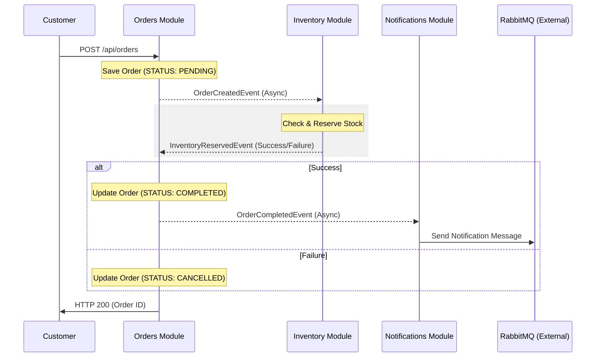

# Modular Order System - Spring Modulith Showcase

This project is a production-grade demonstration of **Modular Monolith** architecture using **Spring Modulith**, **RabbitMQ**, and **Domain-Driven Design (DDD)** principles.

## 🚀 Key Features

- **Modular Architecture**: Strong boundaries enforced by Spring Modulith.
- **Event-Driven Saga**: Decoupled inter-module communication using asynchronous domain events.
- **External Messaging**: Integration with RabbitMQ for shipping notifications.
- **Production-Ready Observability**: Actuator, Prometheus metrics, and JSON logging.
- **API Documentation**: Automated Swagger/OpenAPI 3.0 documentation.
- **Resilient Infrastructure**: PostgreSQL with Flyway migrations and RabbitMQ with DLQ/Retries.

## 🏗 Architecture Overview

The system is divided into three main bounded contexts:

1.  **Orders Module**: Orchestrates the order lifecycle.
2.  **Inventory Module**: Manages stock levels and reservations.
3.  **Notifications Module**: Handles external communication via RabbitMQ.

### Event Flow (Saga)



1.  `OrderService` creates an order...

## 🛠 Tech Stack


- **Language**: Java 21 (Records, Functional Programming)
- **Framework**: Spring Boot 3.4.1 + Spring Modulith
- **Messaging**: RabbitMQ (Asynchronous Saga Pattern)
- **Persistence**: PostgreSQL + Hibernate JPA + Flyway
- **Observability**: Micrometer + Prometheus + Spring Actuator
- **Testing**: JUnit 5 + Mockito + Testcontainers
- **API Documentation**: SpringDoc OpenAPI (Swagger UI)
- **Containerization**: Docker & Multi-stage Dockerfile


## 🚦 Getting Started

### Prerequisites

- Docker and Docker Compose
- JDK 21
- Maven

### Running the Infrastructure

```bash
docker-compose up -d
```

### Running the Application

```bash
./mvnw spring-boot:run
```

## 📖 API Documentation

Once the application is running, you can access:

- **Swagger UI**: [http://localhost:8080/swagger-ui.html](http://localhost:8080/swagger-ui.html)
- **Actuator Health**: [http://localhost:8080/actuator/health](http://localhost:8080/actuator/health)
- **Prometheus Metrics**: [http://localhost:8080/actuator/prometheus](http://localhost:8080/actuator/prometheus)

## 🧪 Testing

The project includes architecture verification and full-flow integration tests:

```bash
./mvnw test
```

- `ModulithArchitectureTest`: Verifies module boundaries and generates PlantUML diagrams.
- `OrderFlowIntegrationTest`: End-to-end saga validation using Testcontainers.

## 📂 Project Structure

```text
com.showcase.ordersystem/
├── orders/           # Public API & Service
│   └── internal/     # Private Entities & Repository
├── inventory/        # Public API & Service
│   └── internal/     # Private Entities & Repository
├── notifications/    # External Messaging Service
├── infrastructure/   # Global Config (RabbitMQ, Exceptions)
└── shared/           # Cross-module Domain Events
```
