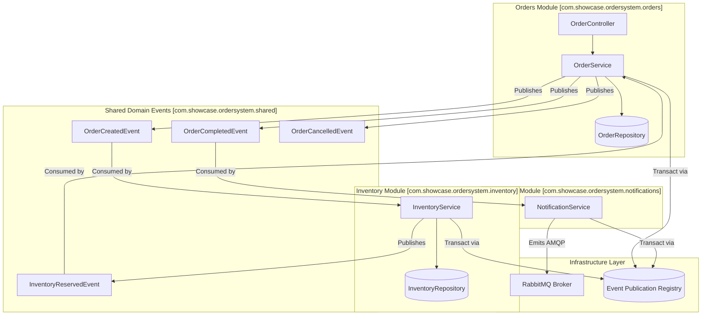
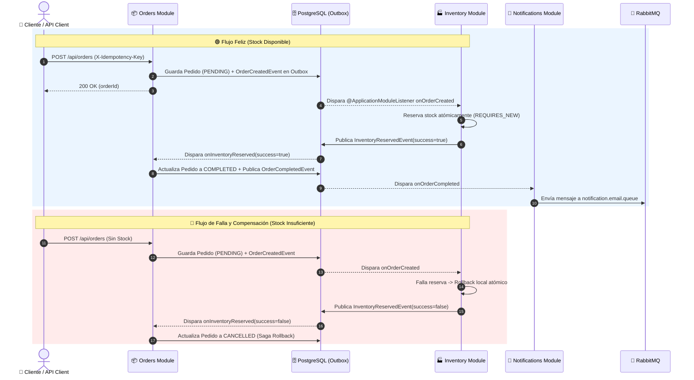

# Modular Order System - Spring Modulith Showcase 🚀

[](https://www.oracle.com/java/)
[](https://spring.io/projects/spring-boot)
[](https://spring.io/projects/spring-modulith)
[](https://github.com/CharlyZeta/spring-modulith-order-saga/actions)
[](https://github.com/CharlyZeta/spring-modulith-order-saga)
[](LICENSE)

Este proyecto es una demostración de nivel profesional sobre cómo construir **Monolitos Modulares** modernos utilizando **Spring Modulith**, **RabbitMQ** y principios de **Domain-Driven Design (DDD)**. 

El objetivo es mostrar una alternativa viable y altamente eficiente a la complejidad operativa de los microservicios, manteniendo la separación de conceptos, la resiliencia transaccional (Saga Pattern), la observabilidad distribuida y la escalabilidad futura.

---

## 🏗️ 1. Arquitectura de Módulos

El sistema está estructurado internamente en **módulos aislados**, validados en tiempo de pruebas por Spring Modulith para evitar el acoplamiento no deseado.


```mermaid
graph TD
    subgraph "Orders Module [com.showcase.ordersystem.orders]"
        OC[OrderController] --> OS[OrderService]
        OS --> OR[(OrderRepository)]
    end

    subgraph "Inventory Module [com.showcase.ordersystem.inventory]"
        IS[InventoryService] --> IR[(InventoryRepository)]
    end

    subgraph "Notifications Module [com.showcase.ordersystem.notifications]"
        NS[NotificationService]
    end

    subgraph "Shared Domain Events [com.showcase.ordersystem.shared]"
        E1[OrderCreatedEvent]
        E2[InventoryReservedEvent]
        E3[OrderCompletedEvent]
        E4[OrderCancelledEvent]
    end

    subgraph "Infrastructure Layer"
        RMQ[RabbitMQ Broker]
        OUTBOX[(Event Publication Registry)]
    end

    OS -- Publishes --> E1
    E1 -- Consumed by --> IS
    IS -- Publishes --> E2
    E2 -- Consumed by --> OS
    OS -- Publishes --> E3 & E4
    E3 -- Consumed by --> NS
    NS -- Emits AMQP --> RMQ
    OS & IS & NS -- Transact via --> OUTBOX
```

---

## 🔄 2. Diagrama de Secuencia del Saga Pattern

El sistema implementa una **Saga Coreografiada** mediante eventos de dominio con garantía de **Transactional Outbox**.


```mermaid
sequenceDiagram
    autonumber
    actor Client as 👤 Cliente / API Client
    participant API as 📦 Orders Module
    participant DB as 🗄️ PostgreSQL (Outbox)
    participant INV as 🏭 Inventory Module
    participant NOTIF as 🔔 Notifications Module
    participant MQ as 🐇 RabbitMQ

    rect rgb(235, 245, 255)
        note over Client, INV: 🟢 Flujo Feliz (Stock Disponible)
        Client->>API: POST /api/orders (X-Idempotency-Key)
        API->>DB: Guarda Pedido (PENDING) + OrderCreatedEvent en Outbox
        API-->>Client: 200 OK (orderId)
        DB-->>INV: Dispara @ApplicationModuleListener onOrderCreated
        INV->>INV: Reserva stock atómicamente (REQUIRES_NEW)
        INV->>DB: Publica InventoryReservedEvent(success=true)
        DB-->>API: Dispara onInventoryReserved(success=true)
        API->>DB: Actualiza Pedido a COMPLETED + Publica OrderCompletedEvent
        DB-->>NOTIF: Dispara onOrderCompleted
        NOTIF->>MQ: Envía mensaje a notification.email.queue
    end

    rect rgb(255, 235, 235)
        note over Client, INV: 🔴 Flujo de Falla y Compensación (Stock Insuficiente)
        Client->>API: POST /api/orders (Sin Stock)
        API->>DB: Guarda Pedido (PENDING) + OrderCreatedEvent
        DB-->>INV: Dispara onOrderCreated
        INV->>INV: Falla reserva -> Rollback local atómico
        INV->>DB: Publica InventoryReservedEvent(success=false)
        DB-->>API: Dispara onInventoryReserved(success=false)
        API->>DB: Actualiza Pedido a CANCELLED (Saga Rollback)
    end
```

---

## ⚠️ 3. Ejemplo Concreto del Caso de Falla (Saga Rollback & Atomic Reservation)

### 🔴 Escenario: Intento de compra con stock insuficiente
Si un cliente intenta crear un pedido solicitando una cantidad superior al stock disponible de un producto, la reserva atómica en `InventoryService` revierte los cambios locales sin dejar "reservas parciales" colgadas en la base de datos.

#### Ejemplo de Petición HTTP (`POST /api/orders`):
```bash
curl -X POST http://localhost:8080/api/orders \
  -H "Content-Type: application/json" \
  -H "X-Idempotency-Key: idempotency-key-sample-123" \
  -d '{
    "customerId": "CUST-999",
    "customerEmail": "cliente@test.com",
    "items": [
      {
        "productId": "PROD-KEYBOARD",
        "productName": "Keychron K2 Mechanical Keyboard",
        "quantity": 500,
        "unitPrice": 99.99
      }
    ]
  }'
```

#### Resultado en la Saga:
1. El módulo de **Orders** registra el pedido en estado `PENDING`.
2. El módulo de **Inventory** intenta reservar 500 unidades dentro de una transacción aislada (`@Transactional(propagation = Propagation.REQUIRES_NEW)`).
3. Al detectar `availableQuantity < 500`, se lanza `InsufficientInventoryException`, revirtiendo la reserva y publicando `InventoryReservedEvent(success=false)`.
4. El módulo de **Orders** recibe la notificación de fallo y actualiza el pedido a **`CANCELLED`**.
5. Ninguna notificación de compra es enviada al usuario.

---

## 🕵️‍♂️ 4. Observabilidad y Trazabilidad Distribuida

El sistema implementa **Micrometer Tracing**, **Brave** y **Zipkin** con propagación de `traceId` a través de hilos virtuales (`Virtual Threads`) y cabeceras de RabbitMQ (`traceparent`).

### ESTRUCTURA DE TRAZA EN ZIPKIN:
```text
[POST /api/orders] ------------------------------------------------------------- (traceId: a1b2c3d4e5f6)
  ├── [OrdersModule: createOrder & persist PENDING] --------------------------- (spanId: 101)
  ├── [Spring Modulith: Outbox Event Publication] ----------------------------- (spanId: 102)
  ├── [InventoryModule: onOrderCreated & reserve stock] ----------------------- (spanId: 103)
  └── [NotificationsModule: onOrderCompleted -> RabbitMQ convertAndSend] ------ (spanId: 104)
        └── [RabbitMQ Queue: notification.email.queue] ------------------------ (spanId: 105)
```

---

## 📜 5. API Documentation & Swagger UI

La documentación de los endpoints está disponible mediante OpenAPI 3 / Swagger UI cuando la aplicación está en ejecución:

* **Swagger UI:** `http://localhost:8080/swagger-ui.html`
* **OpenAPI Specs JSON:** `http://localhost:8080/api-docs`

| Método | Endpoint | Descripción | Cabeceras Opcionales |
|---|---|---|---|
| `POST` | `/api/orders` | Crear un nuevo pedido | `X-Idempotency-Key` |
| `GET` | `/api/orders/{orderId}` | Consultar pedido por ID | - |
| `GET` | `/api/orders` | Listar todos los pedidos (Paginado) | - |
| `POST` | `/api/orders/{orderId}/cancel` | Cancelar un pedido manualmente | - |
| `GET` | `/api/orders/customer/{customerId}` | Listar pedidos por cliente | - |

---

## 🛠️ Stack Tecnológico

* **Java 21** (con Virtual Threads habilitados).
* **Spring Boot 3.4.1**.
* **Spring Modulith 1.3.1** (Verificación arquitectónica y Event Publication Registry).
* **RabbitMQ 3.x** (Mensajería externa y Dead Letter Queue).
* **PostgreSQL 15** & **Flyway** (Gestión de migración de esquema).
* **H2 Database** (Modo PostgreSQL para ejecución autónoma de tests en memoria).
* **Micrometer & Zipkin** (Trazabilidad distribuida).
* **JUnit 5, AssertJ, Awaitility, Mockito, JaCoCo** (Suite completa de pruebas).

---

## 🚀 Cómo Ejecutarlo Localmente

### 1. Levantar Infraestructura con Docker:
```bash
docker-compose up -d
```

### 2. Compilar y Ejecutar la Aplicación:
```bash
./mvnw spring-boot:run
```

### 3. Ejecutar la Suite Completa de Tests:
```bash
./mvnw test
```

### 4. Dashboards y Monitoreo:
* **Swagger UI:** [http://localhost:8080/swagger-ui.html](http://localhost:8080/swagger-ui.html)
* **Zipkin (Trazas):** [http://localhost:9411](http://localhost:9411)
* **Prometheus Metrics:** [http://localhost:8080/actuator/prometheus](http://localhost:8080/actuator/prometheus)
* **RabbitMQ Manager:** [http://localhost:15672](http://localhost:15672) (user: `guest`, pass: `guest`)

---

## 🏷️ GitHub Topics Recomendados (SEO)

Para maximizar la visibilidad del repositorio en GitHub, se recomienda asignar las siguientes etiquetas (*Topics*) en la configuración del repositorio:

`spring-modulith` · `java21` · `spring-boot3` · `saga-pattern` · `modular-monolith` · `rabbitmq` · `domain-driven-design` · `distributed-tracing` · `zipkin` · `flyway` · `outbox-pattern`

---
Desarrollado como un showcase de arquitectura moderna en el ecosistema Spring. 🌍
